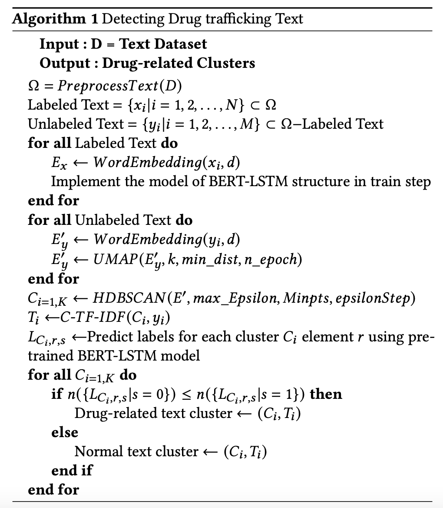

# Detecting illegal drug posts using semi-supervised learning

본 프로젝트는 온라인에서 발생하는 불법 마약 판매 게시글을 탐지 할 수 있는 모델을 개발하는 프로젝트 입니다. 여기서 마약 판매 게시글은 '향정신성 약물을 온라인에서 판매하기 위한 목적이 담긴 글'로 정의하였습니다. 본 프로젝트에서 사용하는 데이터는 SNS(X)에서 약 10만건의 텍스트를 수집하였으며, 수집한 데이터를 이용하여 분류 모델을 개발하였습니다.  

분류 모델을 개발하기 위해 제일 고려한 상황은 **2가지**로 첫번째는 '**적은 target data**'입니다. 매일 수천개의 게시글이 생성되는 SNS 환경에서 마약 매매 게시글은 전체 게시글 대비 매우 극소수의 비율로 구성되어 있습니다. Supervised Learning method를 사용하면 높은 정확도로 분류 할 수 있으나, 현실적으로 많은 데이터를 annotation 하기에는 한계가 명확합니다. 따라서 본 프로젝트에서는 적은 tagged dataset만으로도 높은 정확도로 분류 할 수 있는 모델을 만드는 것을 목표로 하였습니다. 

두번째는 '**은어(Slang)의 사용**' 입니다. 마약 매매 게시글의 가장 큰 특징은 은어를 사용한다는 점 입니다. 예를 들어, 메스암페타민(필로폰)의 경우에는 '아이스','크리스탈','빙두' 등의 은어를 사용하여 특정 마약을 표현합니다. 마약 매매가 불법인 만큼 시간이 지날 수록 더욱 다양한 은어가 생성되고 있습니다. 즉, 동일한 마약을 지칭하는 단어가 시간에 따라 다양화되고 있습니다. 우리는 이러한 특징을 이용하여 동적 토픽 모델링 모델인 BERTopic을 활용하였습니다. 본 모델을 활용하면 동일한 혹은 비슷한 것을 지칭하는 다양한 은어에 대해 효과적으로 clustering 할 수 있습니다.

# Dataset Overview
한국어로 공개된 마약 매매 게시글이 거의 존재하지 않기 때문에 직접 데이터를 수집하였습니다. 데이터 수집은 X(a.k.a Twitter)를 source로 하였으며, 수집 결과 약 10만개의 데이터를 수집할 수 있었습니다.

## Annotation
수집한 데이터에 대해 Annotation을 진행하였으며 그 결과 데이터의 Cohen's Kappa $k$ 값은 0.9628 로 나타났습니다.

** **데이터셋은 아래 링크를 통해 다운 받을 수 있습니다.**  

**Link** : 

### Data Category

수집한 데이터는 다음과 같이 구성되어 있습니다.
|Key word|Normal Post|Drug-related Post|
|:---------:|:---:|:---:|
|아이스(MDMA)|53,223|356|
|크리스탈(MDMA)|19,263|88|
|작대기(MDMA in a syringe)|1,340|0|
|도리도리(narocotics)|27,432|69|
|물뽕(roofies)|1,400|3,277|
|**Total**|102,858|3,790|

# Model Architecture

일반적으로 높은 성능을 보여주는 분류 모델은 supervised-learning 을 사용합니다.이 방법은 높은 정확도로 문서를 분류하지만, label이 반드시 필요하기 때문에 비용이 많이 드는 단점이 있습니다. 본 프로젝트에서 분류하고자 하는 마약 매매 텍스트는 전체 데이터 대비 극도로 적은 비율을 차지하고 있으며, SNS라는 공간 상 매일 생성되는 수 많은 데이터를 모두 annotation 하는 것은 현실적으로 불가능 합니다.  
온라인에토픽 모델링은 효과적으로 주제를 발견하여 군집화 하는 기법입니다. 이러한 토픽 모델링 기법을 이용하여  /모델은 약물 관련 텍스트를 분류하기 위해 제안된 방법의 구조를 간략하게 설명한 것으로, 각각 text classification과 topic modeling 으로 이루어져 있습니다. 전체 데이터는 각각의 구성 요소로 나뉘어서 입력되며, 토픽 모델링의 경우에는 텍스트 데이터를 입력받아 토픽 별로 군집을 형성합니다. 반대로, 분류 모델은 텍스트와 라벨 정보를 입력으로 받아 학습을 진행합니다.

## Topic modeling

마약과 관련된 은어는 수 없이 많으며 하나의 마약을 지칭하는 다양한 은어가 존재합니다. 이러한 다양한 은어의 존재에도 불구하고, 마약 매매와 관련된 게시글의 목적은 
**판매와 관련된 주제**를 가지고 있을 확률이 매우 높으므로 토픽 모델링을 도입하였습니다. 최근 공개된 BERTopic은 전체 document를 임베딩 하여 비슷한 주제를
가지는 텍스트끼리 군집을 형성해주는 모델입니다. 특히 BERTopic에서 사용하는 클래스 기반 tf-idf는 뜻은 같지만 형태는 다른 경우에 대해 효과적으로 같은 군집으로
묶어주는 특징을 가지고 있기 때문에 이번 프로젝트와 잘 어울린다고 판단하였습니다. BERTopic은 기본적으로 Sentence-BERT를 사용하지만, 분류 모델과 모델을 통일하기
위해 BERT(Bert-base)를 활용하였습니다.

## Text classification

분류 모델은 BERT model을 사용하였습니다. 또한 분류 정확도를 높이기 위해 LSTM Layer를 추가하여 정확도를 높혔습니다. 모델의 주요 parameter는 다음과 같습니다.

BERTopic model의 결과물인 군집은 정해지지 않기 때문에 다양한 주제가 존재하는 온라인 데이터 특성 상 적게는 수개부터 많게는 수백 수천개의 군집이 형성 될 수 있습니다.
 수 많은 군집이 생기는 경우, 각 군집이 마약 매매와 직접적인 관련이 있는지 확인을 해야 하기 때문에 분류 모델을 도입하였습니다. 처음부터 분류 모델을 도입할 수 있지만,
 데이터가 매우 많기 때문에 모든 데이터에 대해서 Anntotation 작업을 수행하는것은 비용이 높아 분류 모델에 사용하는 labeled 데이터는 최대한 적게 사용해야 합니다.
따라서 실험 수행 시, 분류 모델에 사용하는 데이터를 10% 단위로 줄여 가면서 실험을 진행하였습니다.

# Evaluation

제안하는 모델의 목적 중 하나는 적은 labeled data로도 높은 정확도를 가지는 모델이므로 이를 평가 하기 위해 train dataset에서 classification model에 사용하는 데이터의 비율을 10% 비율씩 증가시켜서 평가를 진행(검은색-SSL: BERT+LSTM(Test dataset))하였습니다. 또한 supervised learning과 비교하여 최고 성능 대비 정확도가 하락하는지 살펴보았습니다(노란색-Use All data).또한 토픽 모델링을 사용하지 않고, 적은 비율로 학습 데이터로 학습한 모델이 test dataset에 대해 얼마나 잘 판별하는지도 살펴보았습니다(청록색-Test dataset).마지막으로, 단순히 분류 모델이 topic modeling 없이 얼마나 잘 분류하는지, 일반화가 얼마나 되었는지 확인하기 위해 적은 비율로 학습시킨 분류 모델을 이용하여 topic modeling의 입력으로 들어가는 데이터에 대해 분류를 진행하였습니다(보라색-Topic modeling dataset). 모든 실험의 평가 지표는 F-1 score를 사용하였습니다.

  

실험 결과, 데이터의 비율이 가장 낮은 10%의 경우에는 제안하는 모델(SSL: BERT+LSTM)이 지도학습(BERT+LSTM(Test dataset))보다 근소하게 성능이 높음을 확인할 수 있었으며, 분류 모델에 사용하는 데이터의 양을 10%씩 증가시킬 경우, 지도학습은 빠르게 성능이 올라가며 40%의 dataset만 사용하는 경우, 최고 성능을 달성하였음을 확인하였습니다. 또한 제안하는 모델의 경우도 마찬가지로 분류 모델에서 사용하는 학습 데이터의 비율이 증가할수록 완만하게 성능이 향상되고 있음을 볼 수 있었으며, 특히 가장 적은 10%의 경우에서는 오히려 더 좋은 성능을 보여줌을 확인할 수 있었습니다. 한편, 적은 비율로 학습시킨 분류 모델은 30% 까지 일반화 성능이 좋지 않음을 확인할 수 있었습니다. 하지만, 제안하는 모델의 경우에는 topic modeling에서 이미 주제 클러스터가 생성되어 있으므로, 직접적인 비교는 불가능하지만 조금 더 나은 분류 성능을 기대해 볼 수 있습니다.
